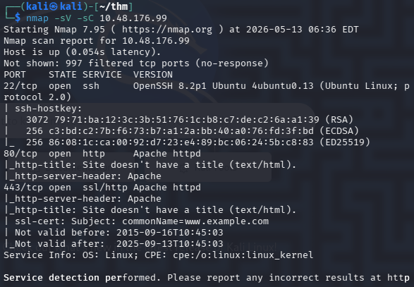
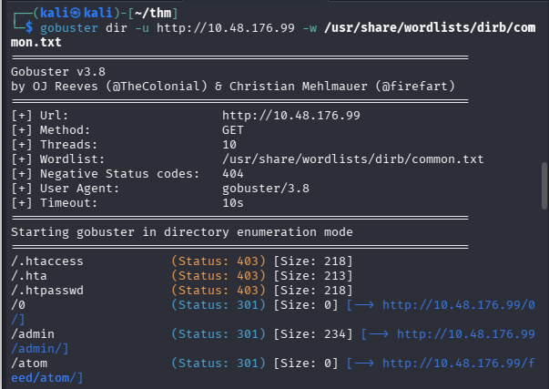
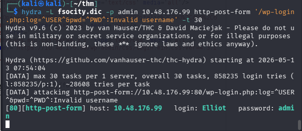
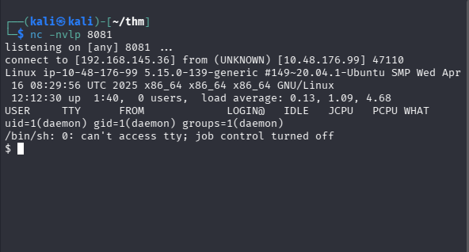
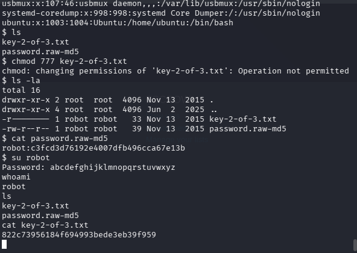
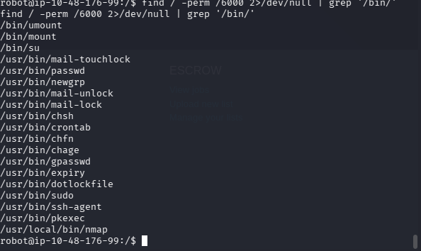
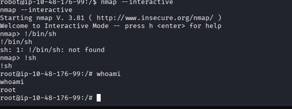
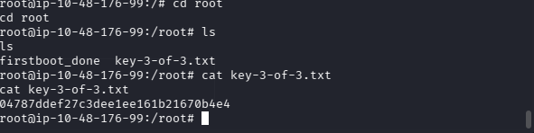

# Mr Robot CTF

## Platform: TryHackMe 
## Category: Linux

## Description:

Can you root this Mr. Robot styled machine? This is a virtual machine meant for beginners/intermediate users. There are 3 hidden keys located on the machine, can you find them?

## Summary:

The target was running a wordpress instance with a weak admin password which can be found via bruteforce. Accessed the admin dashboard once credentials were obtained and injected a reverse shell payload into archive.php using the plugin editor. A reverse shell was obtained using a netcat listener. Privilege escalation was achieved by enumerating SUID binaries and exploiting a misconfigured binary to gain a root shell.

## Reconnaissance:

### Nmap Scan:

22,80 and 443 open ports detected using nmap scan.

### Gobuster:

Found robots.txt and wp-login showing status 200.

fsocity.dic wordlist found in robots.txt. Possibly used for a dictionary attack on wp-login.php wordpress login page.

Found first flag in directory shown in robots.txt

**First Flag: 073403c8a58a1f80d943455fb30724b9**

## Vulnerability:

The target was running a wordpress instance with a weak admin password which can be found via bruteforce. The login point /wp-login.php  had no rate limiting or lock out mechanism to limit the number of attempts making it a significant vulnerability.

### Hydra:

As the error message was displayed on each unsuccessful attempt on the wordpress login page, the -p parameter was considered constant and fsocity.dic was used as the -L parameter. The username was found to be **Elliot** as shown in the screenshot above.

Using Hydra again, the password **ER28-0652** was found.

### Reverse shell:

After logging in using the credentials, we go to the editor tab and paste a reverse shell code in archive.php using the pentestmonkey repo. Then the page can be executed to gain remote access using a netcat listener.

Found the second flag and a md5 hash of user robot’s password in the home directory of robot. Decrypted the hash and switched user to obtain the flag.

**Second Flag: 822c73956184f694993bede3eb39f959**

### SUID binaries:

Found a SUID binary (i.e. /usr/local/bin/nmap) which on execution gives root privileges. The escalation code was retrieved from GTFOBins and root access was gained.

The flag was found in the “root” directory of the root user.

**Third Flag: 04787ddef27c3dee1ee161b21670b4e4**

## References/Tools Used:
Tools: Nmap, Gobuster, Burp Suite, Hydra
References: PentestMonkey repo, GTFOBins
