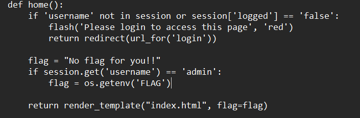
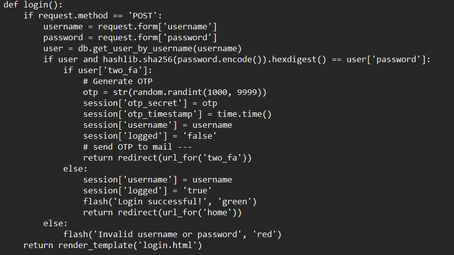
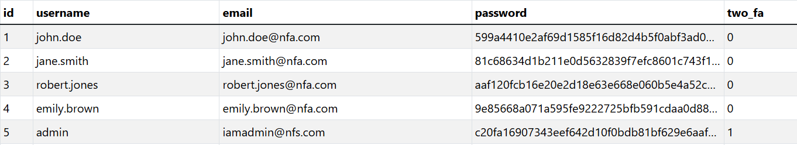
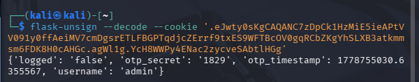
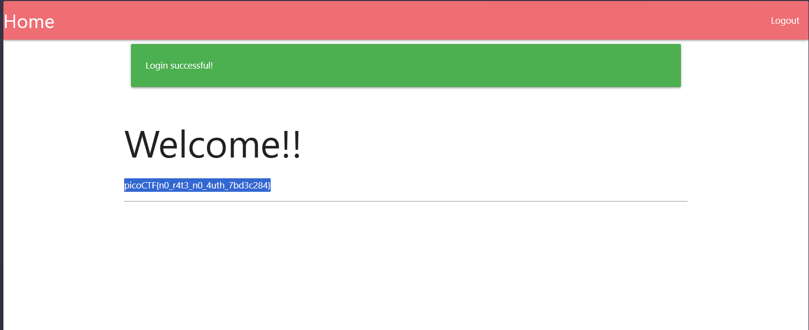

# No FA

## Platform: PicoCTF

## Category: Web

## Description:

Seems like some data has been leaked! Can you get the flag?

## Summary:

The challenge provided application source code and a user database. The flag is obtained by logging in as admin.

## Reconnaissance:

The challenge provided the application code and the user database for the application.

In the application code, it can be observed that we can obtain the flag upon logging in as the admin. 

## Vulnerability:

The application code contains a critical vulnerability in which the OTP for the admin’s two factor authentication is stored in plaintext in the Flask session cookie as shown below.

As the Flask cookies are signed and not encrypted, it is base64-decodable by anyone.

## Exploitation:

The password hash of the admin can be retrieved from the user database provided.

After decrypting the hash, we get the admin’s password as **apple@123**.

The credentials are entered and we land on the OTP Verification Page. The session cookie is extracted after clicking on Inspect → Network tab → HTTP Response Header → session.

The session cookie is decoded using flask unsign to get the OTP 1829.

After entering the OTP, we get the flag - picoCTF{n0_r4t3_n0_4uth_7bd3c284}.

## References/Tools Used:

Tools: flask unsign, hashes.com
